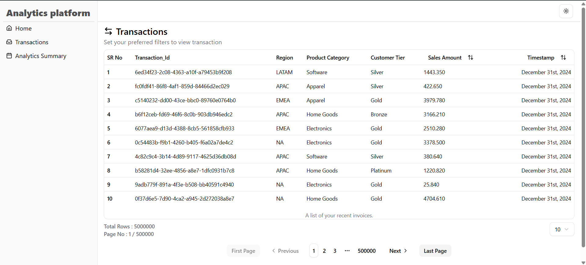
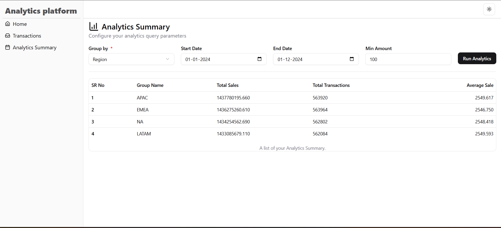
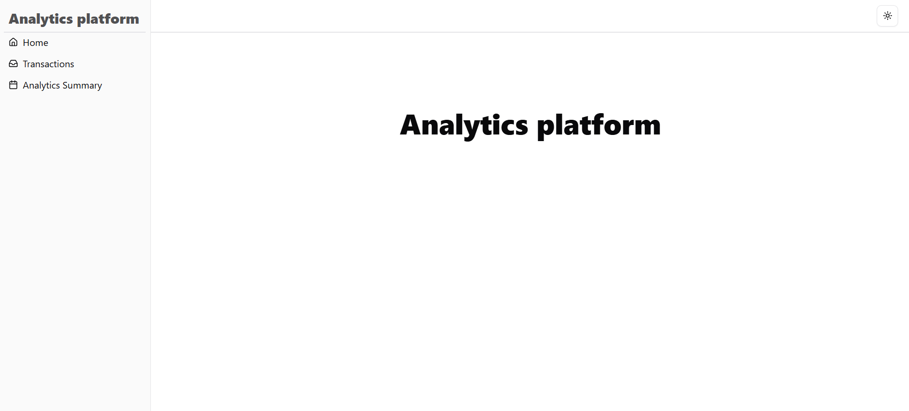

# 📊 **Global Sales Analytics Platform (MERN Stack)**

A high-performance analytics platform built using the **MERN stack**, capable of processing **millions of global sales transactions** with optimized backend aggregation and a seamless frontend UI.

This project focuses on:

- 🏎 **High-speed MongoDB aggregations**
- ⚡ **Optimized querying & indexing**
- 📈 **Real-time analytics visualization**
- 🧩 **Scalable MERN architecture**

---

# 📁 **1. Document Schema (MongoDB)**

Each transaction document contains:

| Field             | Type            | Description                                |
| ----------------- | --------------- | ------------------------------------------ |
| `transactionId`   | String (unique) | Unique ID for each transaction             |
| `timestamp`       | Date            | Transaction date (1–2 year range)          |
| `region`          | String          | NA, EMEA, APAC, LATAM                      |
| `productCategory` | String          | Electronics, Apparel, Home Goods, Software |
| `salesAmount`     | Number          | Random amount between 10–5000              |
| `customerTier`    | String          | Bronze, Silver, Gold, Platinum             |

---

# ✔ **2. Data Generation**

- Dataset generated using **Faker.js**
- Inserted into MongoDB in optimized **batches of 50,000**
- Designed to scale up to **5M+ documents** without lag

---

# 🖥️ **3. Backend (Node.js + Express + MongoDB)**

The backend is built for **massive datasets** and uses:

- ⚡ Optimized aggregation pipelines
- 🧠 Compound indexes
- 📚 Pagination + Sorting
- 💾 Disk-enabled aggregations (`allowDiskUse`)
- 🚀 Super-fast response times even for millions of records

---

# 🟦 **A. Analytics Summary API**

### **`GET /api/v1/analytics/summary`**

Performs heavy analytics on millions of documents **without timeout**.

### 📌 **Query Parameters**

| Param       | Type   | Required | Description                             |
| ----------- | ------ | -------- | --------------------------------------- |
| `groupBy`   | String | Yes      | region / productCategory / customerTier |
| `startDate` | Date   | No       | Filter after this date                  |
| `endDate`   | Date   | No       | Filter before this date                 |
| `minAmount` | Number | No       | salesAmount >= minAmount                |

### 📤 **Output Example**

```json
[
  {
    "groupName": "NA",
    "totalSales": 5029931.23,
    "totalTransactions": 140233,
    "averageSale": 358.12
  }
]
```

### ⚡ **MongoDB Optimization**

- Compound indexes
- `$match → $group` pipeline structure
- Disk-based operations
- Controlled date filtering
- Index-aware sorting

---

# 🟦 **B. Paginated Transactions API**

### **`GET /api/v1/transactions`**

Efficiently returns only required records — **never loads all 5M documents**.

### 📌 Query Parameters

| Param    | Type   | Required | Purpose                        |
| -------- | ------ | -------- | ------------------------------ |
| `page`   | Number | Yes      | Current page number            |
| `limit`  | Number | Yes      | Rows per page (10, 20, 50)     |
| `sortBy` | String | No       | Sort (timestamp / salesAmount) |

### 📤 Example Output

```json
{
  "currentPage": 1,
  "totalPages": 120000,
  "totalRecords": 5000000,
  "dataList": []
}
```

### ⚡ Optimization

- Fast `.skip()` + `.limit()`
- Optional cursor-based pagination
- Indexed sorting for speed

---

# 🎨 **4. Frontend (React + Shadcn UI)**

Frontend is built for smooth performance even with large datasets.

---

## 🅰️ **Analytics Dashboard**

✔ GroupBy dropdown
✔ Date filters
✔ Minimum salesAmount filter
✔ Tables
✔ Loader for heavy queries
✔ New aggregation takes **~5 sec** on 5M docs

---

## 🅱️ **Paginated Transaction Table**

Features:

- Pagination (First / Prev / Pages / Next / Last)
- Sorting on column click
- 10–50 rows only (optimized rendering)
- Virtual DOM windowing → **No UI freeze**

---

# 🛠 **5. Tech Stack**

| Area     | Technology                      |
| -------- | ------------------------------- |
| Frontend | React.js, Shadcn UI             |
| Backend  | Node.js, Express.js             |
| Database | MongoDB (Indexes + Aggregation) |
| Data Gen | Faker.js                        |
| ORM      | Mongoose                        |

---

# ⚙️ **6. Installation & Setup**

---

## 🟩 **Backend Setup**

### 1️⃣ Create `.env`

```
CLIENT_URL=http://localhost:5173
PORT=3000
MONGO_URI=mongodb://localhost:27017/analyticsDB
```

### 2️⃣ Install Dependencies

```bash
cd server
npm install
```

### 3️⃣ Seed Database

```bash
node ./src/Seeds/transactions_seed.js
```

### 4️⃣ Start Backend

```bash
npm run dev
```

---

## 🟦 **Frontend Setup**

### 1️⃣ Add `.env`

```
VITE_BACKEND_URL=http://localhost:3000
```

### 2️⃣ Install Dependencies

```bash
cd client
npm install
npm run dev
```

---

# 📸 **Screenshots**

## 🖥️ **1. Analytics Dashboard (Summary View)**

> Real-time aggregation results based on groupBy, date range, and minimum sale amount.

```

```

---

## 📄 **2. Paginated Transactions Table**

> Fast, high-performance table that loads millions of records with pagination & sorting.

```

```

---

## 🧭 **3. Home Page / Landing Page (Optional)**

```

```

---

# 📄 **License**

This project is licensed under the **MIT License**.

---

# 👨‍💻 **Author**

**Deepak Kumar Yadav**
Full-Stack Developer (MERN & Laravel)

🔗 GitHub: [https://github.com/your-username](https://github.com/your-username)
🔗 LinkedIn: [https://linkedin.com/in/your-profile](https://linkedin.com/in/your-profile)
